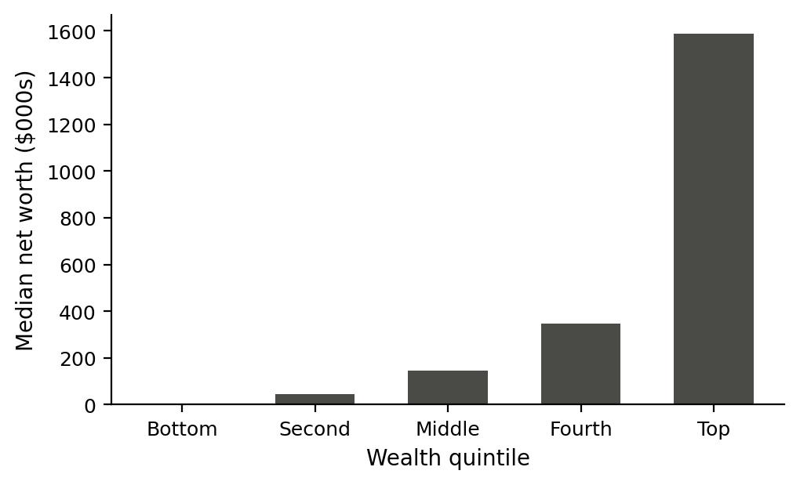

<!--
Standalone rendering check for the "nature" design-sets draft.
Knit this file directly, or via ../../render-design-sets.R, to confirm the
draft format.yml in this same folder still compiles cleanly before you
promote it to repo/inst/sets/. `style: "."` points at this folder's own
format.yml, not the installed package version of this style id.
-->

# Introduction

This paragraph establishes the body text. It should be long enough to show the
measure, the leading, and how the typeface handles ordinary running prose at
its intended reading size. Notice the treatment of *emphasis*, **strong
emphasis**, and `inline code`, each of which draws on a different face of the
type family.

A second paragraph confirms the paragraph spacing token and whether the style
indents first lines or separates paragraphs with vertical space. The two
choices are mutually exclusive and a style should commit to one.

## A second-level heading

Second-level headings carry the `h2` scale token. They should read as clearly
subordinate to `h1` without collapsing into the body text. A useful test is
whether you can identify the hierarchy from across the room.

### A third-level heading

Third-level headings usually sit at or near the body size and rely on weight
alone. If `h3` is indistinguishable from bold body text, the type scale is too
compressed.

#### A fourth-level heading

Fourth-level headings are the deepest level most styles bother to render
distinctly; some styles fold `h4` into the body text with only italics or a
run-in label. Either choice is legitimate — this level exists in the specimen
so that choice is visible rather than accidental.

## Lists and quotations

An unordered list:

- The first item, kept short.
- The second item, which runs long enough to wrap onto a second line so that
  hanging indentation can be assessed.
- The third item.

An ordered list:

1. Establish the measure.
2. Set the scale.
3. Choose the accent.

> A block quotation. It should be distinguishable from body text by indentation,
> size, or colour, and it should not be confused with a code block.

## Tables

Tables use `booktabs` rules. The table below should sit comfortably within the
measure, and in two-column styles it must promote itself to a spanning float.

| Quintile | Median wealth | Share of total | Change since 2019 |
|:---------|--------------:|---------------:|------------------:|
| Bottom   |       \$6,030 |           0.4% |             +2.1% |
| Second   |      \$43,760 |           2.5% |             +4.8% |
| Middle   |     \$145,200 |           8.1% |             +6.2% |
| Fourth   |     \$347,800 |          19.4% |             +5.5% |
| Top      |   \$1,589,300 |          69.6% |            +11.3% |

## A figure



Figure captions exercise `figure.caption.position` and `figure.caption.style`.
A style's figure treatment should read as clearly related to its table
treatment above, even though the two are set by different tokens.

## Code and mathematics

Syntax highlighting is set by the `highlight` token:

```r
wealth <- readRDS("scf2022.rds")
quintiles <- wealth |>
  dplyr::mutate(q = dplyr::ntile(net_worth, 5)) |>
  dplyr::summarise(median = median(net_worth), .by = q)
```

Inline mathematics, $\sigma^2 = \sum_i p_i (x_i - \mu)^2$, sits within the
line. Display mathematics stands alone:

$$
G = \frac{1}{2n^2\bar{x}} \sum_{i=1}^{n} \sum_{j=1}^{n} |x_i - x_j|
$$

## Links, citations, and long prose

A [link](https://example.org) should take the accent colour. A bibliographic
claim needs a citation [@Author2020], and a style with a running argument
often cites more than one source at once [@Author2020; @Smith2019]. The
reference list at the end of this document exercises the bibliography
treatment.

The remainder of this section is filler set at length, so that the specimen
runs past a single page and exposes the running header, the footer, and the
page number treatment.

Wealth is far more concentrated than income, and the gap has widened across
every measurement period since the survey began. The top quintile holds roughly
seven of every ten dollars of household net worth, a share that has grown even
as median wealth has recovered from its post-crisis trough. Decomposing the
change reveals that most of the gain accrued through asset appreciation rather
than saving, which implies that the distribution of wealth is now more sensitive
to asset prices than to household behaviour.

This has an uncomfortable corollary. Policies aimed at raising the saving rate
of households in the bottom half of the distribution operate on a margin that
has become small relative to the valuation channel. A household in the second
quintile that doubles its saving rate closes a smaller fraction of the gap than
a single year of equity returns opens. Whether that argues for redistribution,
for broadening asset ownership, or for neither, is a question this specimen
document is not equipped to settle.

### A closing subsection

The final heading confirms that section spacing holds at the bottom of a page
and that no heading is orphaned from the text it introduces.

# References
